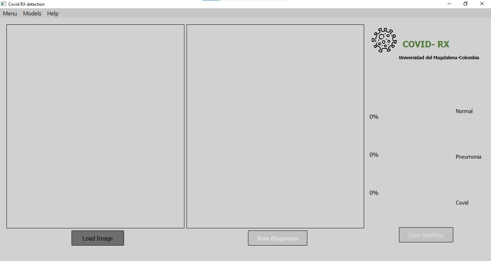
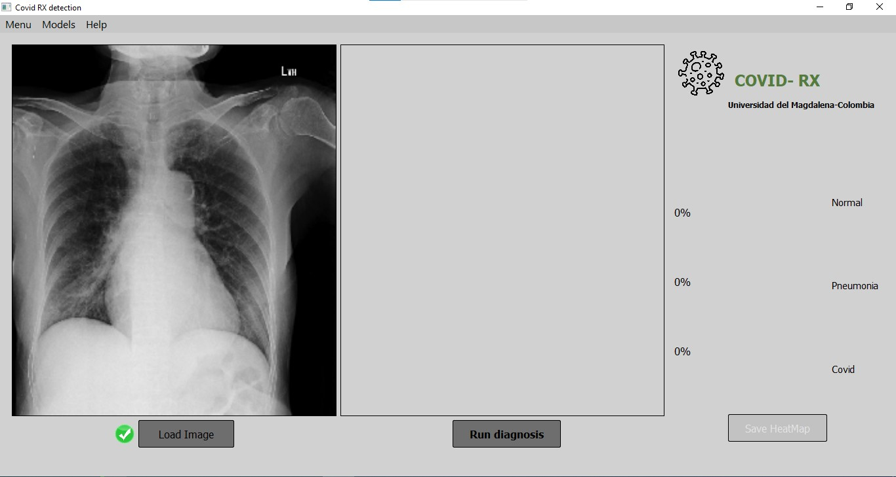
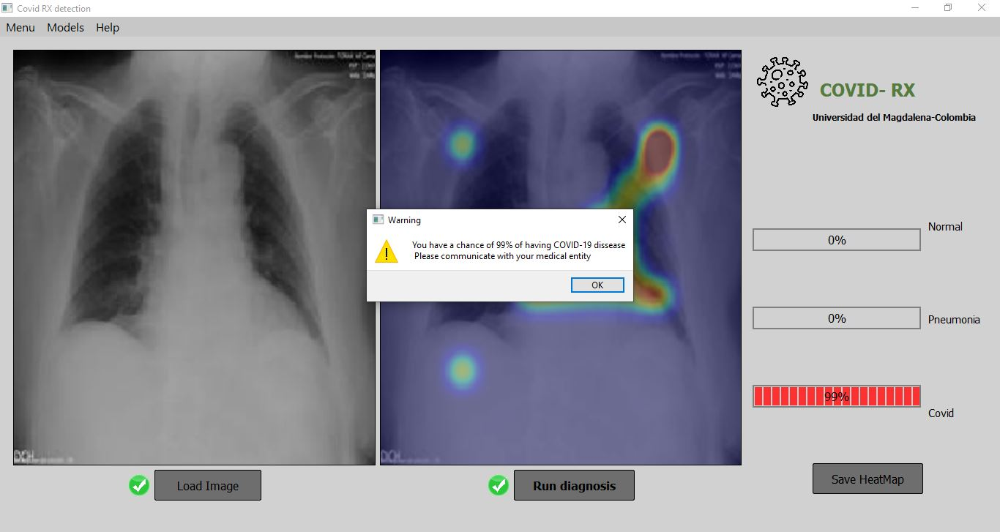
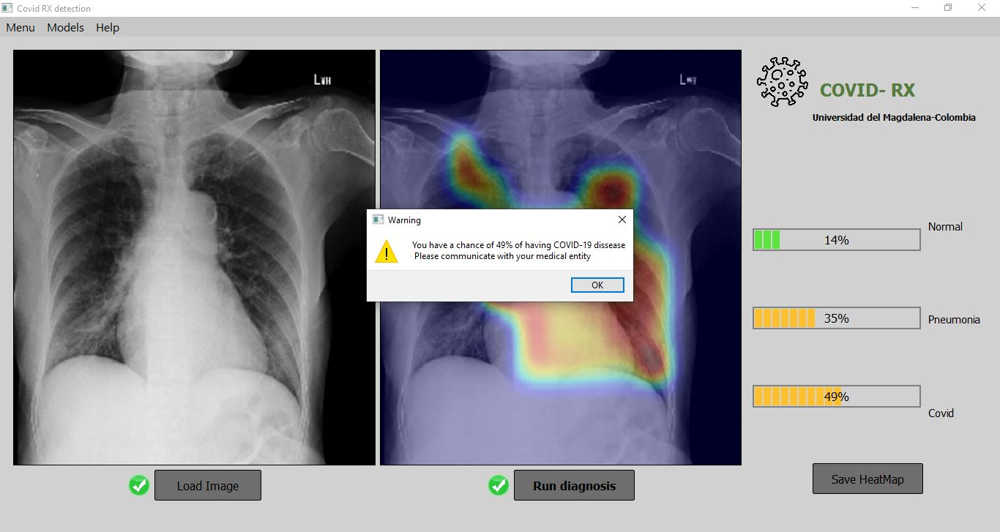
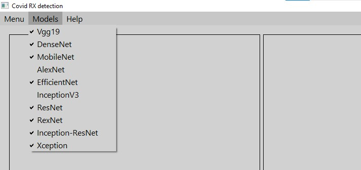
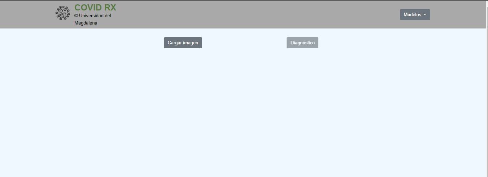
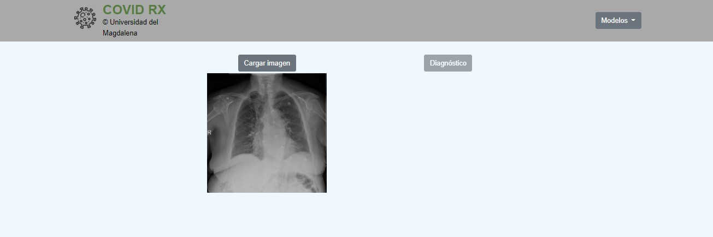
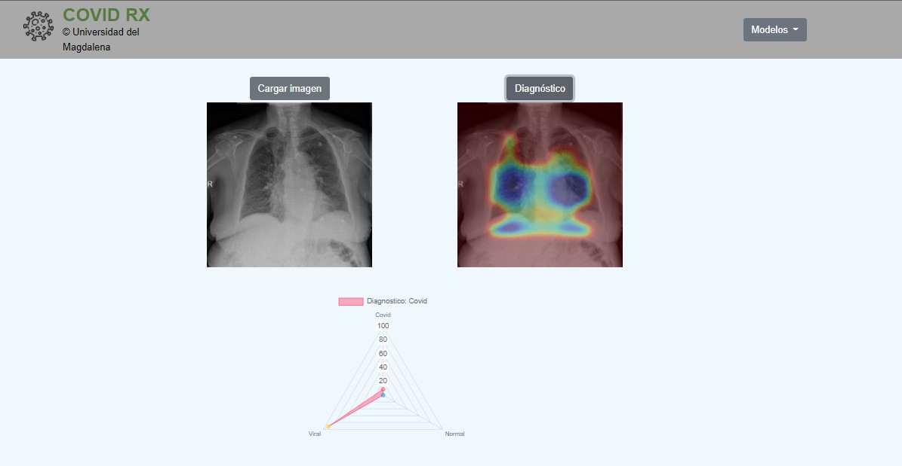

<h2>Run the applications</h2>

<h3>Setting your Virtual environment</h3>

<p>
    it is an optional step but is highly recommended to work over a virtual environment based on python 3.8, . You can create your virtual enviorment running the following code line:
</p>


```
    python3.8 -m venv <env_name>
```

<p>
    if you are using anaconda you just can write the following code line:
</p>

```
    conda create --name <env_name> python=3.8
```

<p>Activating the virtual environment:<p>


```
    cd <env_name> \Scripts\activate.bat
```

<p>Anaconda:<p>

```
    conda activate <env_name>
```


<h3>Download Repository</h3>

<p>it can be downloaded using:</p>

```
    git clone https://github.com/DavidNavarroSaiz/CovidRX_Interface.git
```

<h3>Install libraries</h3>


```
    pip install -r requirements.txt
```


<h3>Desktop App: How to use</h3>

<p>Exectuing the desktop app</p>


```
    cd src
    python app.py
```

<div align="center">
    
</div>

<p> Click load image Button, an emerging window will display. Please choose the image you want to evaluate and click Open image.</p>

<div align="center">
    
</div>

<p> You can click now Run Diagnosis button, and wait a moment until the diagnosis is completed, it will display a message, you can read your final diagnosis and then click OK </p>

<div align="center">
    
</div>

<p> A heat map is displayed, it shows the main zones activated by the Convolutional neural network layers. It can be an indicator about what are the most affected zones in the person. however, it is not a trustable indicator and it is not based on qualitative methods, it is just an analysis about the activation map of the neural networks, so does not necessarily represent valid medical information</p>


<p> On the right side of the application you can check the probabilities to be Normal, to have pneumonia or to have covid. If the bar is green it means that you have low probabilities( less than 30%), if it is yellow it is a high-mid probability(30% - 60%) and if the bar is red it means that it is a high probability(higher than 60%) </p>


<div align="center">
    
</div>


<p> The user can save the heatmap clicking Save heatmap button, it will appear an emerging window, where you can choose the location and the name to save the heatmap </p>


<p> As said before, the diagnosis is based on CNN so there are 10 trained models that you can select or deselect, if you select more than one model, then it will average the results of the selected models. You can change the models selection in the top bar menu,and you can choose the models of your preference:</p>
<div align="center">
    
</div>

<h3>web App: How to use</h3>

<p>Exectuing the Web app</p>

```
    cd src
    cd sites
    python webApp.py

```
<p> copy and paste the http://127.0.0.1:5000/ in any navigator of preference. </p>
<div align="center">
    
</div>

<p> Click load image, choose the image that you want to diagnose and click open. </p>

<div align="center">
    
</div>

<p> Click diagnosis and the algorithm will analyze the image. </p>
<div align="center">
    
</div>
<p>
it will display a heatmap of the diagnosis, and a plot with the distribution of probbility of being normal, pneumonia or covid. 

</p>


